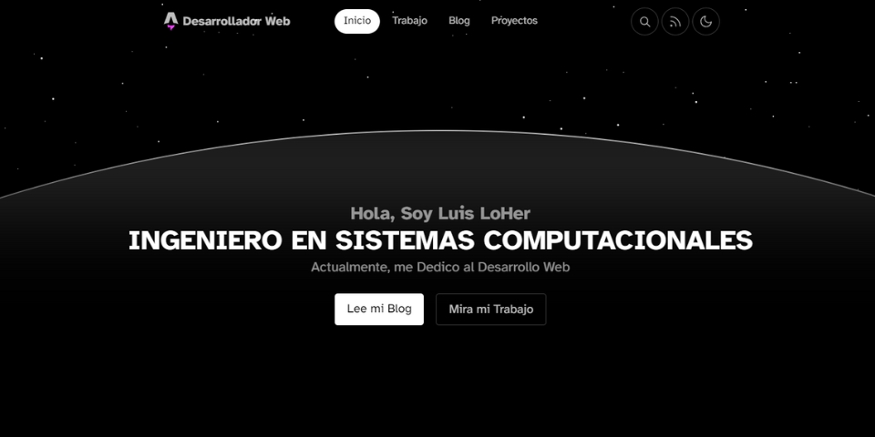

Este repositorio es de mi web personal, construida con una plantilla de Astro. Empezó siendo estática, pero le estoy dando un toque híbrido. Es minimalista, liviana y vuela en velocidad.

Las técnologías usadas principalmente son: 
- Astro
- Tailwind 
- Typescript
- SolidJS (un poco)

## 🚀 Despliegue
[Netlify](https://luisloher.netlify.app)

## 🗺️ Roadmap

Sin Fechas Específicas

- ✔️ Publicación General de la Página Web
- ⬜ Pestaña de Portafolio
- ⬜ Pestaña de Cursos (Gratuitos)
- ⬜ Pestaña de Divulgación Científica
- ⬜ Pestaña de Blog
- ⬜ Pestaña de Acerca de
- ⬜ Pestaña de Proyectos

## 🏛️ License

MIT

# Versión 1.0.0

